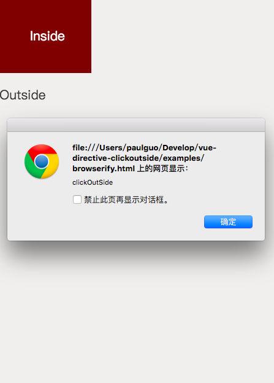

## {{ name }}

### 使用示例

```

<div id="bodyCont">
    <vue-template></vue-template>
</div>

<script type="text/javascript">
    new Vue({
        el: '#bodyCont',
        data: {}
    });
</script>
```

### Directive支持的属性(Props)

| 属性 | 支持的值 |
|:----------|:----------------------------------------------------------------------------|
| prop | prop-description |

### 暴露的方法列表

| 方法名 | 产生的动作 |
|:----------|:----------------------------------------------------------------------------|
| method | method-description |

### 监听的事件列表

| 事件名称 | 产生的动作 |
|:----------|:----------------------------------------------------------------------------|
| vue-template-event | event-description |

### 使用截图


